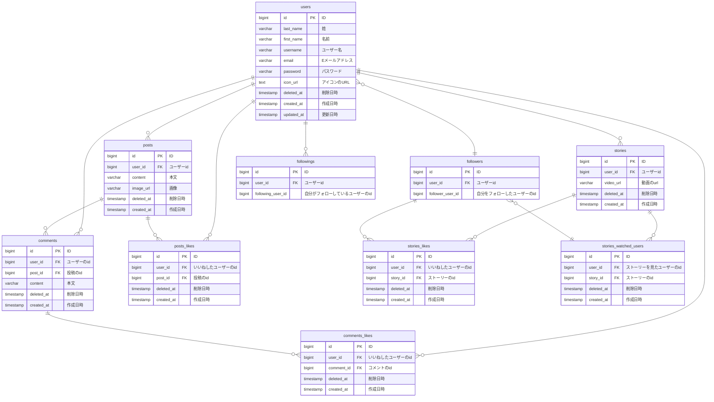

```mermaid
erDiagram
    users ||--o{ posts : ""
    users ||--o{ stories : ""
    users }o--|| followers : ""
    users ||--o{ followings : ""
    users ||--o{ comments : ""
    users ||--o{ posts_likes : ""
    users ||--o{ comments_likes : ""

    posts ||--o{ comments : ""
    posts ||--o{ posts_likes : ""

    stories ||--o{ stories_likes : ""
    stories ||--o{ stories_watched_users : ""

    followers }o--|| stories_watched_users : ""
    followers ||--o{ stories_likes : ""

    comments ||--o{ comments_likes : ""

    users {
      bigint id PK "ID"
      varchar last_name "姓"
      varchar first_name "名前"
      varchar username "ユーザー名"
      varchar email "Eメールアドレス"
      varchar password "パスワード"
      text icon_url "アイコンのURL"
      timestamp deleted_at "削除日時"
      timestamp created_at "作成日時"
      timestamp updated_at "更新日時"
    }

    followers {
      bigint id PK "ID"
      bigint user_id FK "ユーザーid"
      bigint follower_user_id "自分をフォローしたユーザーのid"
    }

    followings {
      bigint id PK "ID"
      bigint user_id FK "ユーザーid"
      bigint following_user_id "自分がフォローしているユーザーのid"
    }

    posts {
      bigint id PK "ID"
      bigint user_id FK "ユーザーid"
      varchar content "本文"
      varchar image_url "画像"
      timestamp deleted_at "削除日時"
      timestamp created_at "作成日時"
    }

    posts_likes {
      bigint id PK "ID"
      bigint user_id FK "いいねしたユーザーのid"
      bigint post_id FK "投稿のid"
      timestamp deleted_at "削除日時"
      timestamp created_at "作成日時"
    }

    stories_likes {
      bigint id PK "ID"
      bigint user_id FK "いいねしたユーザーのid"
      bigint story_id FK "ストーリーのid"
      timestamp deleted_at "削除日時"
      timestamp created_at "作成日時"
    }

    comments_likes {
      bigint id PK "ID"
      bigint user_id FK "いいねしたユーザーのid"
      bigint comment_id FK "コメントのid"
      timestamp deleted_at "削除日時"
      timestamp created_at "作成日時"
    }

    comments {
      bigint id PK "ID"
      bigint user_id FK "ユーザーのid"
      bigint post_id FK "投稿のid"
      varchar content "本文"
      timestamp deleted_at "削除日時"
      timestamp created_at "作成日時"
    }

    stories {
      bigint id PK "ID"
      bigint user_id FK "ユーザーid"
      varchar video_url "動画のurl"
      timestamp deleted_at "削除日時"
      timestamp created_at "作成日時"
    }

    stories_watched_users {
      bigint id PK "ID"
      bigint user_id FK "ストーリーを見たユーザーのid"
      bigint story_id FK "ストーリーのid"
      timestamp deleted_at "削除日時"
      timestamp created_at "作成日時"
    }
```