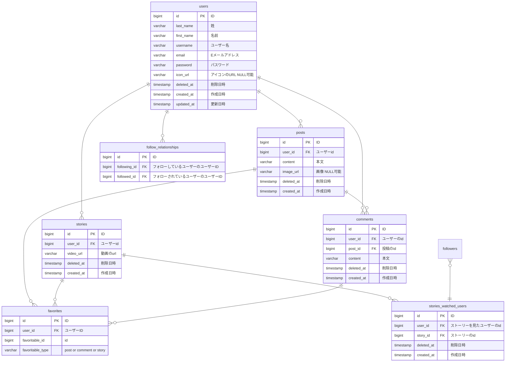

```mermaid
erDiagram
    users ||--o{ posts : ""
    users ||--o{ stories : ""
    users ||--o{ comments : ""
    users ||--o{ follow_relationships : ""

    posts ||--o{ comments : ""

    posts ||--o{ favorites : ""
    stories ||--o{ favorites : ""
    comments ||--o{ favorites : ""

    stories ||--o{ stories_watched_users : ""

    followers }o--|| stories_watched_users : ""


    users {
      bigint id PK "ID"
      varchar last_name "姓"
      varchar first_name "名前"
      varchar username "ユーザー名"
      varchar email "Eメールアドレス"
      varchar password "パスワード"
      varchar icon_url "アイコンのURL NULL可能"
      timestamp deleted_at "削除日時"
      timestamp created_at "作成日時"
      timestamp updated_at "更新日時"
    }

    follow_relationships {
      bigint id PK "ID"
      bigint following_id FK "フォローしているユーザーのユーザーID"
      bigint followed_id FK "フォローされているユーザーのユーザーID"
    }

    posts {
      bigint id PK "ID"
      bigint user_id FK "ユーザーid"
      varchar content "本文"
      varchar image_url "画像 NULL可能"
      timestamp deleted_at "削除日時"
      timestamp created_at "作成日時"
    }

    comments {
      bigint id PK "ID"
      bigint user_id FK "ユーザーのid"
      bigint post_id FK "投稿のid"
      varchar content "本文"
      timestamp deleted_at "削除日時"
      timestamp created_at "作成日時"
    }

    stories {
      bigint id PK "ID"
      bigint user_id FK "ユーザーid"
      varchar video_url "動画のurl"
      timestamp deleted_at "削除日時"
      timestamp created_at "作成日時"
    }

    favorites {
      bigint id PK "ID"
      bigint user_id FK "ユーザーID"
      bigint favoritable_id "id"
      varchar favoritable_type "post or comment or story"
    }

    stories_watched_users {
      bigint id PK "ID"
      bigint user_id FK "ストーリーを見たユーザーのid"
      bigint story_id FK "ストーリーのid"
      timestamp deleted_at "削除日時"
      timestamp created_at "作成日時"
    }
```