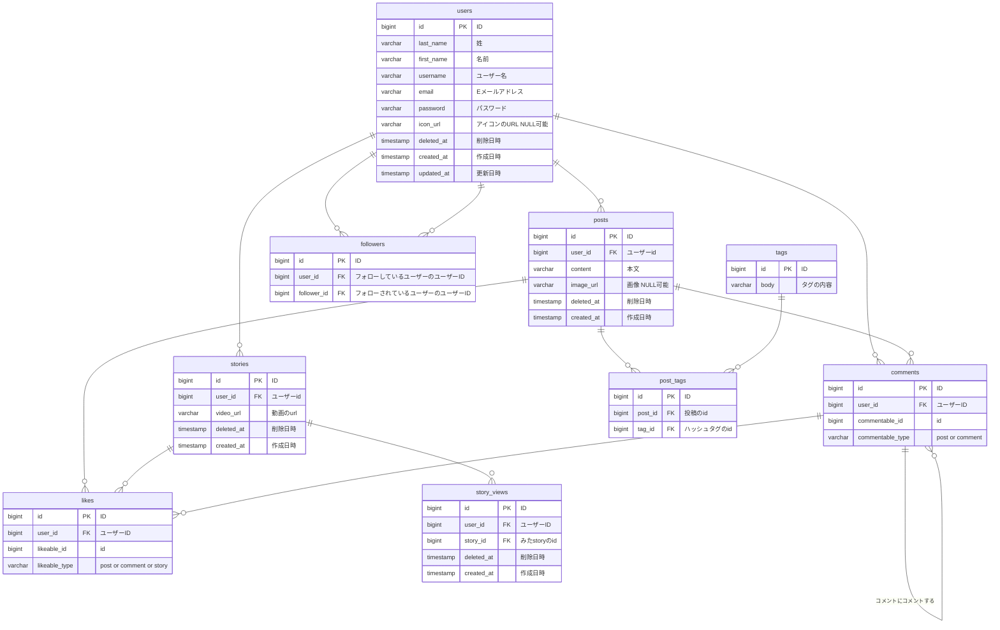

```mermaid
erDiagram
    users ||--o{ posts : ""
    users ||--o{ stories : ""
    users ||--o{ comments : ""
    users ||--o{ followers : ""
    followers }o--|| users : ""

    posts ||--o{ comments : ""
    posts ||--o{ post_tags : ""

    tags ||--o{ post_tags : ""

    posts ||--o{ likes : ""
    stories ||--o{ likes : ""
    comments ||--o{ likes : ""

    comments ||--o{ comments : "コメントにコメントする"

    stories ||--o{ story_views : ""

    users {
      bigint id PK "ID"
      varchar last_name "姓"
      varchar first_name "名前"
      varchar username "ユーザー名"
      varchar email "Eメールアドレス"
      varchar password "パスワード"
      varchar icon_url "アイコンのURL NULL可能"
      timestamp deleted_at "削除日時"
      timestamp created_at "作成日時"
      timestamp updated_at "更新日時"
    }

    followers {
      bigint id PK "ID"
      bigint user_id FK "フォローしているユーザーのユーザーID"
      bigint follower_id FK "フォローされているユーザーのユーザーID"
    }

    posts {
      bigint id PK "ID"
      bigint user_id FK "ユーザーid"
      varchar content "本文"
      varchar image_url "画像 NULL可能"
      timestamp deleted_at "削除日時"
      timestamp created_at "作成日時"
    }

    tags {
      bigint id PK "ID"
      varchar body "タグの内容"
    }

    post_tags {
      bigint id PK "ID"
      bigint post_id FK "投稿のid"
      bigint tag_id FK "ハッシュタグのid"
    }

    comments {
      bigint id PK "ID"
      bigint user_id FK "ユーザーID"
      bigint commentable_id "id"
      varchar commentable_type "post or comment"
    }

    stories {
      bigint id PK "ID"
      bigint user_id FK "ユーザーid"
      varchar video_url "動画のurl"
      timestamp deleted_at "削除日時"
      timestamp created_at "作成日時"
    }

    likes {
      bigint id PK "ID"
      bigint user_id FK "ユーザーID"
      bigint likeable_id "id"
      varchar likeable_type "post or comment or story"
    }

    story_views {
      bigint id PK "ID"
      bigint user_id FK "ユーザーID"
      bigint story_id FK "みたstoryのid"
      timestamp deleted_at "削除日時"
      timestamp created_at "作成日時"
    }
```