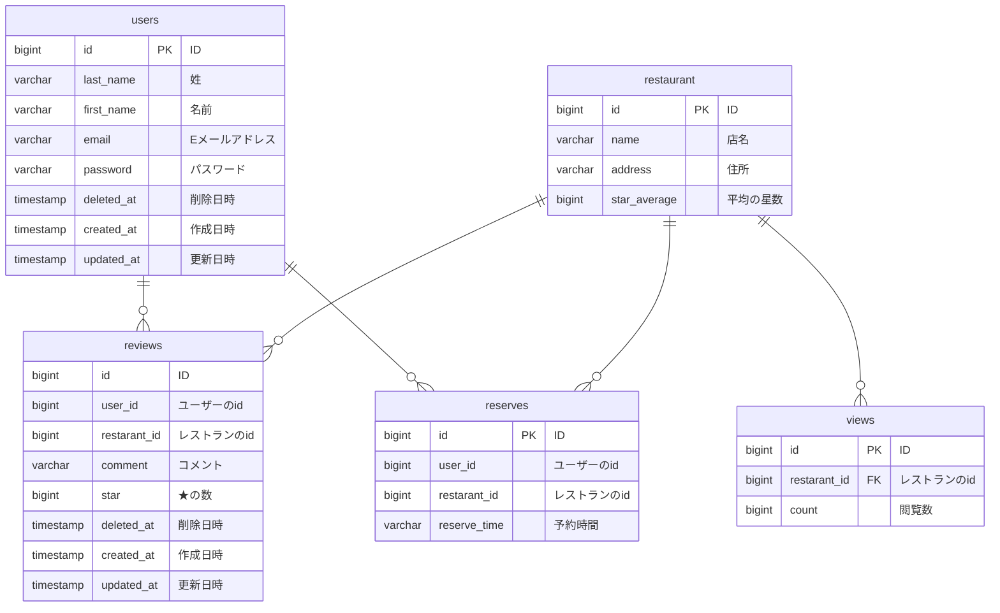

```mermaid
erDiagram
    users ||--o{ reviews : ""
    users ||--o{ reserves : ""

    restaurant ||--o{ reviews : ""
    restaurant ||--o{ views : ""
    restaurant ||--o{ reserves : ""

    users {
      bigint id PK "ID"
      varchar last_name "姓"
      varchar first_name "名前"
      varchar email "Eメールアドレス"
      varchar password "パスワード"
      timestamp deleted_at "削除日時"
      timestamp created_at "作成日時"
      timestamp updated_at "更新日時"
    }

    restaurant {
      bigint id PK "ID"
      varchar name "店名"
      varchar  address "住所"
      bigint star_average "平均の星数"
    }

    views {
      bigint id PK "ID"
      bigint restarant_id FK "レストランのid"
      bigint count "閲覧数"
    }

    reviews {
      bigint id "ID"
      bigint user_id "ユーザーのid"
      bigint restarant_id "レストランのid"
      varchar comment "コメント"
      bigint star "★の数"
      timestamp deleted_at "削除日時"
      timestamp created_at "作成日時"
      timestamp updated_at "更新日時"
    }

    reserves {
      bigint id PK "ID"
      bigint user_id "ユーザーのid"
      bigint restarant_id "レストランのid"
      varchar reserve_time "予約時間"
    }

```